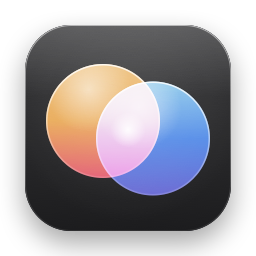

<p align="center">
  
</p>

<h1 align="center">Duochrome</h1>

<p align="center">RAW 현상부터 레이어 리터칭까지 한 창에서 끝내는 macOS 사진 앱</p>

<p align="center">
  <a href="https://github.com/doozymalen/duochrome/releases/latest"></a>
  
  
  
</p>

대량 보정·사진 관리와 레이어 심화 보정, 유선 테더링 촬영을 하나의 카탈로그로 오갑니다.
내보내고 다시 여는 왕복 없이, 같은 사진·같은 조정을 세 모드가 함께 씁니다.

## 설치

1. [최신 릴리스](https://github.com/doozymalen/duochrome/releases/latest)에서 `Duochrome.dmg`를 받습니다.
2. 열어서 `Duochrome.app`을 응용 프로그램 폴더로 끌어 놓습니다.
3. 애플 개발자 서명이 없는 앱이라 처음 열 때 macOS가 막습니다. 응용 프로그램 폴더에서 **오른쪽 클릭 → 열기 → 열기**로 한 번 허용하세요.

```bash
xattr -dr com.apple.quarantine /Applications/Duochrome.app   # 터미널로 허용할 때
```

### 필요한 것

- macOS 14 (Sonoma) 이상, Apple 실리콘 맥
- AI 엔진을 이 맥에서 쓰면 여유 공간 약 10GB (처음 쓸 때 받습니다)

### 지우기

앱을 휴지통으로 옮긴 뒤, 필요하면 아래 폴더도 지웁니다. 카탈로그와 사진 조정값은 `~/Pictures/Duochrome`에 있습니다.

```bash
rm -rf ~/Library/Application\ Support/Duochrome   # AI 엔진·테더링 도구·설정 파일
defaults delete com.doozymalen.duochrome            # 앱 설정
```

## 기능

**대량 보정**
- RAW 현상 (macOS가 여는 모든 카메라: 캐논·니콘·소니·후지필름·OM 시스템·파나소닉·펜탁스·라이카·하셀블라드 등): 노출·화이트 밸런스·HDR·커브·레벨·컬러 에디터·컬러 밸런스·클래리티·디헤이즈·노이즈·렌즈 보정·키스톤
- 사진 관리: 카탈로그, 별점·채택·색 태그·키워드·앨범·스마트 앨범, 검색, 백업
- 조정 복사·골라 붙이기, 스타일, 일괄 내보내기(JPEG·PNG·HEIC·TIFF 8/16/32비트·DNG·웹용)

**심화 보정**
- 조정·이미지·글자·모양·칠 레이어, 그룹, 마스크(붓·그라디언트·선택·벡터·밝기 범위), 혼합 모드, 레이어 스타일
- 선택 도구(사각형·올가미·자석·빠른 선택·자동 선택·색상 범위), 선택 및 마스크
- 브러시·지우개·복구·복제·패치·닷지·번, 자유 변형·뒤틀기·퍼펫 뒤틀기·픽셀 유동화
- 필터 100가지 이상(흐림·선명·왜곡·스타일화·렌더·필터 갤러리), 펜·패스, 텍스트(세로쓰기·뒤틀기·패스 위 글자)
- PSD·PSB 읽고 쓰기(레이어째), 8/16/32비트, CMYK·Lab·회색조, 동작 기록·일괄 처리

**테더링**
- USB로 연결한 카메라(libgphoto2가 지원하는 캐논·니콘·소니·후지필름 등)의 조리개·셔터·ISO·화이트 밸런스 원격 변경, 라이브 뷰, AF·수동 초점·확대 (카메라가 지원하는 것만 보입니다)
- 찍으면 바로 카탈로그에 들어오고, 직전 사진이나 복사한 조정을 자동으로 적용
- 구도 참고 그림 겹치기, 파일 이름 규칙

**AI**
- 이 맥에서: 피사체·하늘·사람·개체 선택, 배경 지우기, 자르기 추천, 지우기·스마트 지우기, 피부 매끄럽게
- 구글 코랩(선택): 생성형 채우기·확장, 노이즈 제거, 반사 제거, 2배 확대 — 연결되지 않으면 이 맥에서 처리합니다

## 자주 묻는 질문

**처음 열 때 "확인되지 않은 개발자" 경고가 떠요.**
서명 인증서가 없는 앱이라 그렇습니다. [설치](#설치)의 3번처럼 한 번 허용하면 다음부터는 바로 열립니다.

**카메라를 꽂아도 테더링에서 찾지 못해요.**
USB 케이블로 연결하고 카메라를 켜 주세요. 카메라 회사 프로그램이나 이미지 캡처처럼 카메라를 쓰는 다른 앱은 닫아 주세요. 소니는 카메라 메뉴에서 USB 연결을 'PC 원격'으로, 니콘·후지필름도 테더(PC 연결) 방식으로 바꿔야 할 수 있습니다. 무선 연결은 지원하지 않습니다.

**내 카메라가 지원되나요?**
도움말 → 지원 카메라에서 이 맥이 RAW를 여는 기종과 테더링이 아는 기종을 찾아볼 수 있습니다. RAW 현상은 macOS가 지원하는 기종을 따르고, macOS를 올리면 늘어납니다.

**AI 기능이 느려요.**
생성형 채우기·노이즈 제거처럼 무거운 일은 이 맥에서 오래 걸립니다. 설정 → AI에서 구글 코랩을 연결하면(유료 사용량 필요) 코랩 L4에서 처리합니다.

## 외부 연결

Duochrome은 사용 기록을 보내지 않습니다. 아래 경우에만 인터넷에 연결합니다.

- **AI 엔진 설치** (AI 메뉴에서 설치할 때): GitHub, Hugging Face, PyPI, astral.sh에서 엔진과 공개 모델을 받습니다
- **구글 코랩** (설정에서 켰을 때만): 처리할 사진 조각을 코랩으로 보내고 결과를 받습니다
- **테더링 도구 설치** (테더링 모드를 처음 열 때): PyPI에서 python-gphoto2를 받습니다

## 빌드

Xcode 없이 Command Line Tools만으로 빌드됩니다 (Swift, AppKit).

```bash
git clone https://github.com/doozymalen/duochrome.git
cd duochrome
bash scripts/build-app.sh      # build/Duochrome.app을 만들고 /Applications에 설치
```

설치하지 않으려면 `DUOCHROME_NO_INSTALL=1`을 붙입니다. 배포용 `build/Duochrome.dmg`(끌어 놓아 설치하는 창)는 `bash scripts/make-dmg.sh`로 만듭니다.

## 쓴 오픈소스

- [libgphoto2](http://www.gphoto.org) (python-gphoto2) — 테더링, LGPL-2.1
- [ComfyUI](https://github.com/comfyanonymous/ComfyUI) — AI 엔진, GPL-3.0
- [comfyui-inpaint-nodes](https://github.com/Acly/comfyui-inpaint-nodes), LaMa, SCUNet, Real-ESRGAN, FLUX.1 Fill, [XReflection](https://github.com/hainuo-wang/XReflection) — AI 모델과 부품 (각 배포처의 라이선스)

모두 앱에 넣어 배포하지 않고, 쓸 때 사용자 폴더 안에 따로 받습니다.

## 라이선스

© 2026 doozymalen. All rights reserved.
사용 허가(라이선스)를 따로 주지 않습니다. 코드는 볼 수 있지만, 허락 없이 복제·수정·재배포할 수 없습니다.

Duochrome은 여기 나온 카메라 회사들과 관계가 없으며, 각 이름은 그 회사의 상표입니다.
